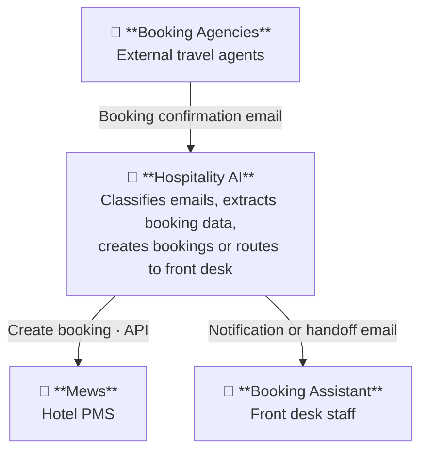

# Architecture

Diagrams are written in [Mermaid](https://mermaid.js.org/) using C4 notation and render natively on GitHub.

## C1 — System Context (MVP)

> MVP scope: email channel from booking agencies only. Hotel Website, Channel Manager, Booking Portals, Hotel Guest, and Hotel Manager are out of scope for the MVP.

