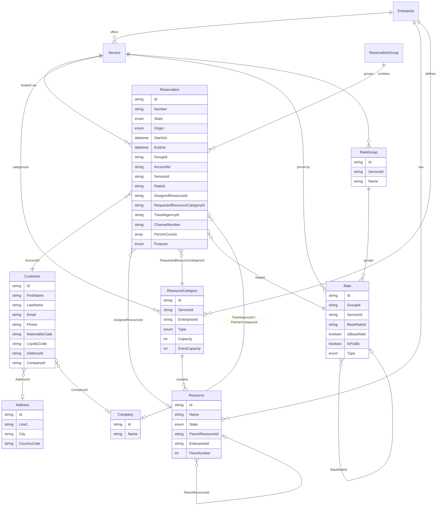
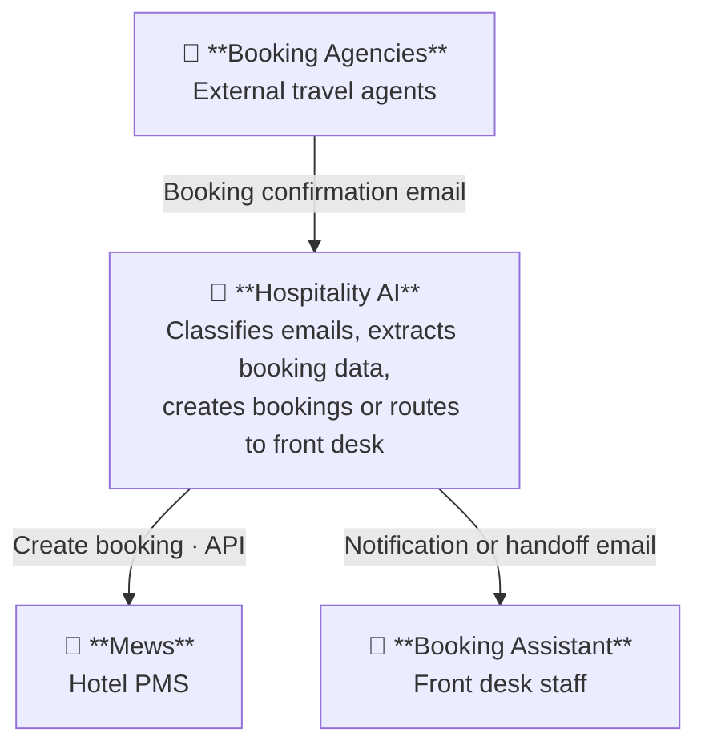

# Architecture

Diagrams are written in [Mermaid](https://mermaid.js.org/) using C4 notation and render natively on GitHub and GitLab.

---

## Conventions

- **Diagrams**: Mermaid + C4 model. C4 levels in use: C1 (Context), C2 (Container), C3 (Component) where needed.
- **Storage**: diagrams as Mermaid fenced code blocks in this README — no separate `.puml` files, no CI rendering step.
- **General principles**:
  - Monorepo — code and docs live together
  - ADRs for significant architecture decisions (see [`../adr/README.md`](../adr/README.md))
  - AI-first development: prompts versioned in `ai/prompts/`, agents in `ai/agents/`

### Repo structure (planned)

```
apps/           # User-facing applications (web, dashboard, api)
services/       # Backend services (booking, channel-integration, email-parser)
packages/       # Shared code (types, utilities)
ai/             # Agents, prompt templates, evaluations
infrastructure/ # Terraform, Docker
docs/
  architecture/ # Architecture diagrams (this folder)
  adr/          # Architecture Decision Records
  domain/       # Business rules, glossary, flows, event storming
.claude/
  CLAUDE.md     # Claude agent context (deliberately small — pointers to docs above)
```

---

## Mews Data Model

Key entities in the [Mews Connector API](https://docs.mews.com/connector-api) relevant to booking integration.



## C1 — System Context (MVP)

> MVP scope: email channel from booking agencies only. Hotel Website, Channel Manager, Booking Portals, Hotel Guest, and Hotel Manager are out of scope for the MVP.


