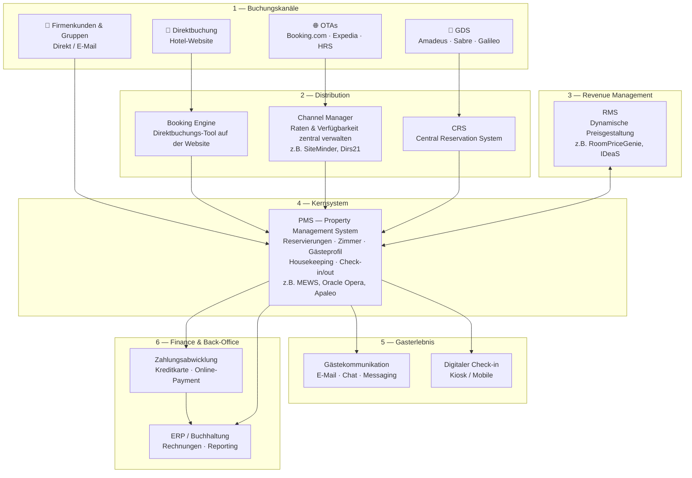

# Business Model Discussion

## Hotel Tech Stack

Typischer Tech Stack eines Hotels — basierend auf Marktrecherche.

**Quellen:** [SiteMinder](https://www.siteminder.com/r/hotel-tech-stack/) · [Mews](https://www.mews.com/en/blog/hotel-tech-stack) · [Cloudbeds](https://www.cloudbeds.com/articles/hotel-tech-stack/) · [RoomPriceGenie](https://roompricegenie.com/essential-tech-trio-pms-channel-manager-rms/)
