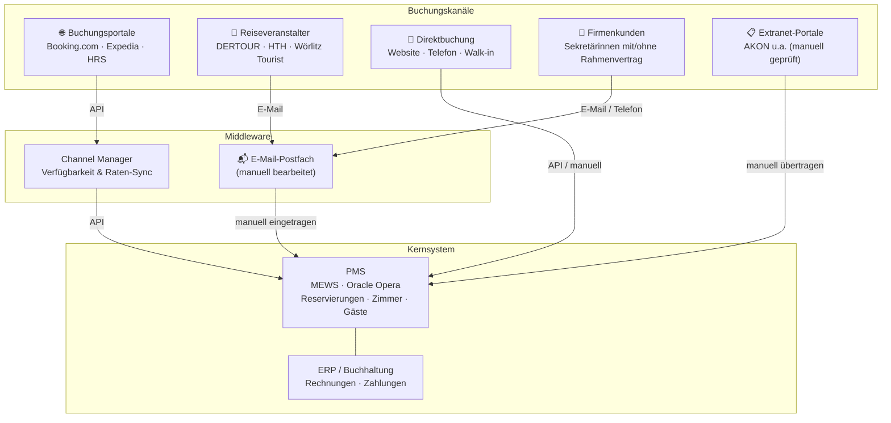

# Business Model Discussion

## Hotel Tech Stack

**Beobachtungen aus Interviews:**
- Der Channel Manager hat einen Timelag von 20–30 min → Überbuchungsrisiko
- Alles was nicht über den Channel Manager läuft, landet manuell im PMS
- Extranet-Portale (z.B. AKON) haben keine API — rein manueller Abgleich
- E-Mail ist der größte manuelle Kanal: Agenturen, Firmenkunden, Gästekommunikation
