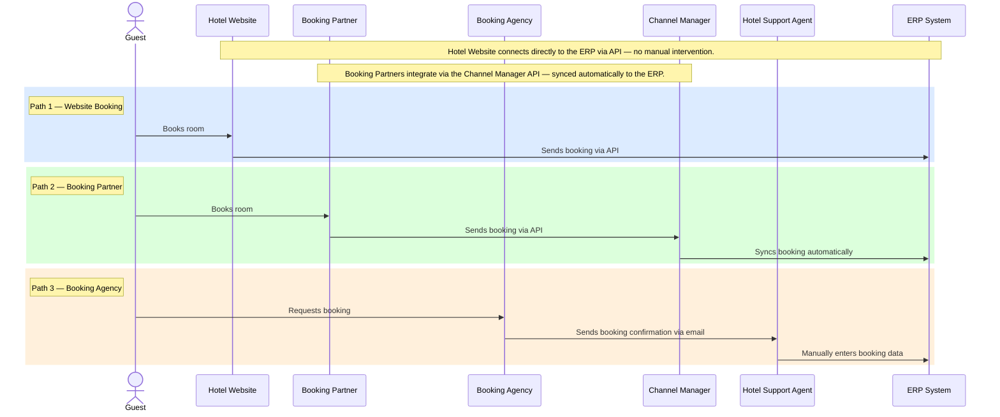

# Domain

Business flows and rules for Hospitality AI.

## Current Booking Flow (As-Is)

> How bookings reach the hotel today, before Hospitality AI is in the picture.

```mermaid
sequenceDiagram
  actor Guest
  participant Website as Hotel Website
  participant Partner as Booking Partner
  participant Agency as Booking Agency
  participant CM as Channel Manager
  participant Agent as Hotel Support Agent
  participant ERP as ERP System

  Note over Website,ERP: Hotel Website connects directly to the ERP via API — no manual intervention.
  Note over Partner,CM: Booking Partners integrate via the Channel Manager API — synced automatically to the ERP.

  rect rgb(220, 235, 255)
    Note left of Guest: Path 1 — Website Booking
    Guest->>Website: Books room
    Website->>ERP: Sends booking via API
  end

  rect rgb(220, 255, 220)
    Note left of Guest: Path 2 — Booking Partner
    Guest->>Partner: Books room
    Partner->>CM: Sends booking via API
    CM->>ERP: Syncs booking automatically
  end

  rect rgb(255, 240, 220)
    Note left of Guest: Path 3 — Booking Agency
    Guest->>Agency: Requests booking
    Agency->>Agent: Sends booking confirmation via email
    Agent->>ERP: Manually enters booking data
  end
```
