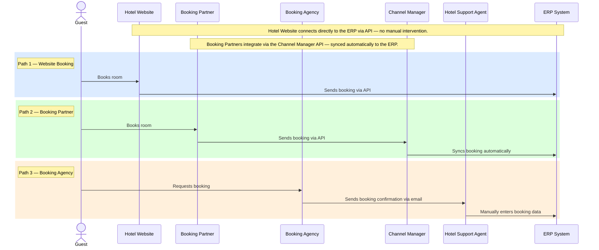

# Domain

Business flows, rules, and domain model for Hospitality AI.

---

## Domain Model

### Personas

- **Hotel Guest** — books rooms, manages their stay
- **Booking Assistant** — hotel staff who process and manage incoming bookings
- **Hotel Manager** — oversees hotel operations and performance

Detailed persona profiles live in [`personas/`](personas/) as `<slug>.md` files.

### Booking channels

| Channel | Integration method |
|---|---|
| Hotel Website | Direct API |
| Booking Agencies (e.g. travel agents) | Email (parsed, AI-powered) |
| Booking Portals (e.g. booking.com) | API via Channel Manager |

### External systems

- **Channel Manager** — third-party system that manages availability and rates across booking portals. Currently the only external system in production.

---

## Current Booking Flow (As-Is)

> How bookings reach the hotel today, before Hospitality AI is in the picture.

---

## Conventions

### Domain flow files

Domain flow files live in `docs/domain/` (or a relevant subfolder) as `flow_<name>.md` files — e.g. `problem/user_flows/flow_booking_current_state.md`.

Each flow uses a Mermaid `sequenceDiagram` with these conventions:

- `actor` for humans, `participant` for systems — with short aliases and descriptive labels
- `note over` at the top for assumptions, spanning the relevant participants
- Each logical path wrapped in a `rect` block with a label: `Note over <first>,<last>: <Path Name>`
- Colors cycle through: `rgb(235, 245, 255)` → `rgb(235, 255, 240)` → `rgb(255, 245, 235)` → `rgb(250, 235, 255)` → `rgb(235, 255, 255)`

The `/new-flow` slash command scaffolds a new flow file following these conventions.

### Event Storming files

Event Storming output lives in `docs/domain/` (or `docs/domain/solution/` when scoped to a specific solution) as `event_storming_<scope>.md` files — e.g. [`solution/event_storming_email_channel.md`](solution/event_storming_email_channel.md).

Each file contains a Mermaid `flowchart LR` with these conventions:

- One node per domain event, named in past tense (`EmailReceived`, `BookingPersisted`)
- Linear left-to-right flow representing time order
- Two node classes:
  - `event` — orange fill `#FFB547`, stroke `#E89A2B`, text `#3a2400` (the standard Event Storming sticky color)
  - `hotspot` — same fill, but red stroke `#E84A4A`, stroke-width `3px` — used for events with unresolved questions
- Apply classes via `class <ids> <className>` lines below the flow definition
- After the diagram, include an **Open hotspots** table (event, question, why it matters) and an **Out of scope** section listing what was deliberately not covered

Mermaid `flowchart` renders natively in both GitHub and GitLab markdown previews — no CI step needed.

### Persona files

Personas live in [`personas/`](personas/) as `<slug>.md` files. The `/new-persona` slash command scaffolds a new persona file. Completed personas should be linked from the [Domain Model](#domain-model) section above.
