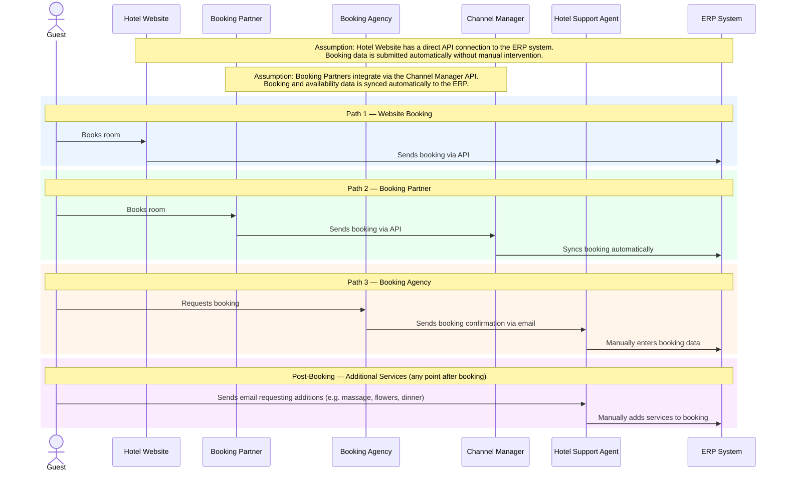

## Current Booking Process — As-Is


```mermaid
sequenceDiagram
    actor Guest
    participant Website as Hotel Website
    participant Partner as Booking Partner
    participant Agency as Booking Agency
    participant CM as Channel Manager
    participant Agent as Hotel Support Agent
    participant ERP as ERP System

    note over Website,ERP: Assumption: Hotel Website has a direct API connection to the ERP system.<br/>Booking data is submitted automatically without manual intervention.
    note over Partner,CM: Assumption: Booking Partners integrate via the Channel Manager API.<br/>Booking and availability data is synced automatically to the ERP.

    rect rgb(235, 245, 255)
        Note over Guest,ERP: Path 1 — Website Booking
        Guest->>Website: Books room
        Website->>ERP: Sends booking via API
    end

    rect rgb(235, 255, 240)
        Note over Guest,ERP: Path 2 — Booking Partner
        Guest->>Partner: Books room
        Partner->>CM: Sends booking via API
        CM->>ERP: Syncs booking automatically
    end

    rect rgb(255, 245, 235)
        Note over Guest,ERP: Path 3 — Booking Agency
        Guest->>Agency: Requests booking
        Agency->>Agent: Sends booking confirmation via email
        Agent->>ERP: Manually enters booking data
    end

    rect rgb(250, 235, 255)
        Note over Guest,ERP: Post-Booking — Additional Services (any point after booking)
        Guest->>Agent: Sends email requesting additions (e.g. massage, flowers, dinner)
        Agent->>ERP: Manually adds services to booking
    end
```
```
