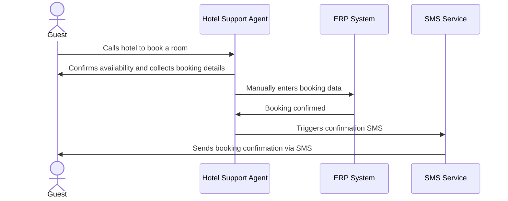

## Phone Booking Process

```mermaid
sequenceDiagram
    actor Guest
    participant Agent as Hotel Support Agent
    participant ERP as ERP System
    participant SMS as SMS Service

    Guest->>Agent: Calls hotel to book a room
    Agent->>Guest: Confirms availability and collects booking details
    Agent->>ERP: Manually enters booking data
    ERP->>Agent: Booking confirmed
    Agent->>SMS: Triggers confirmation SMS
    SMS->>Guest: Sends booking confirmation via SMS
```
