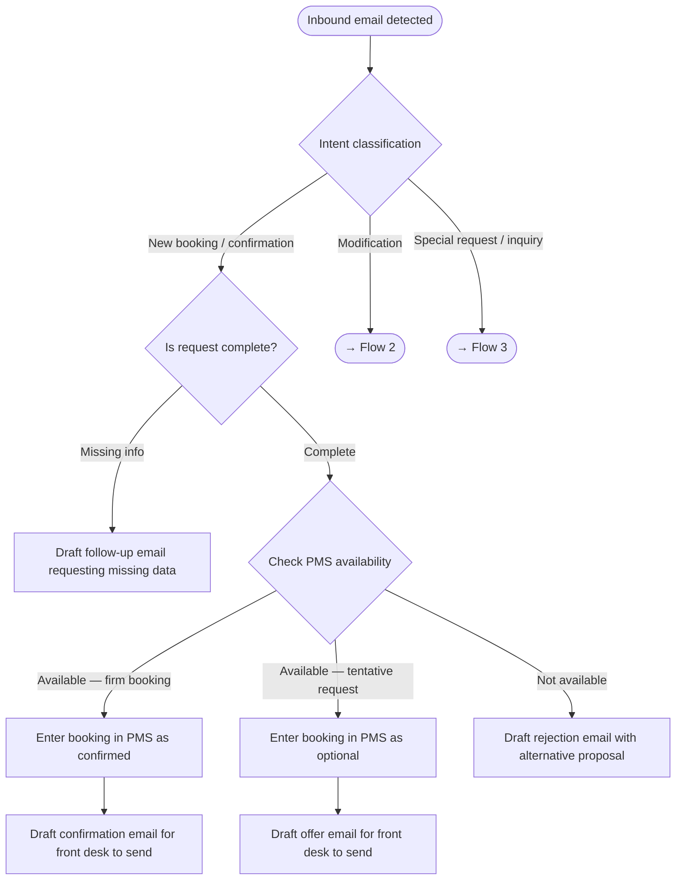
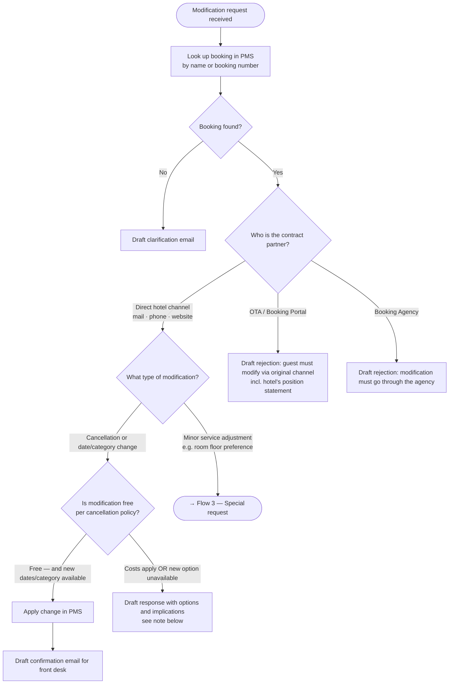
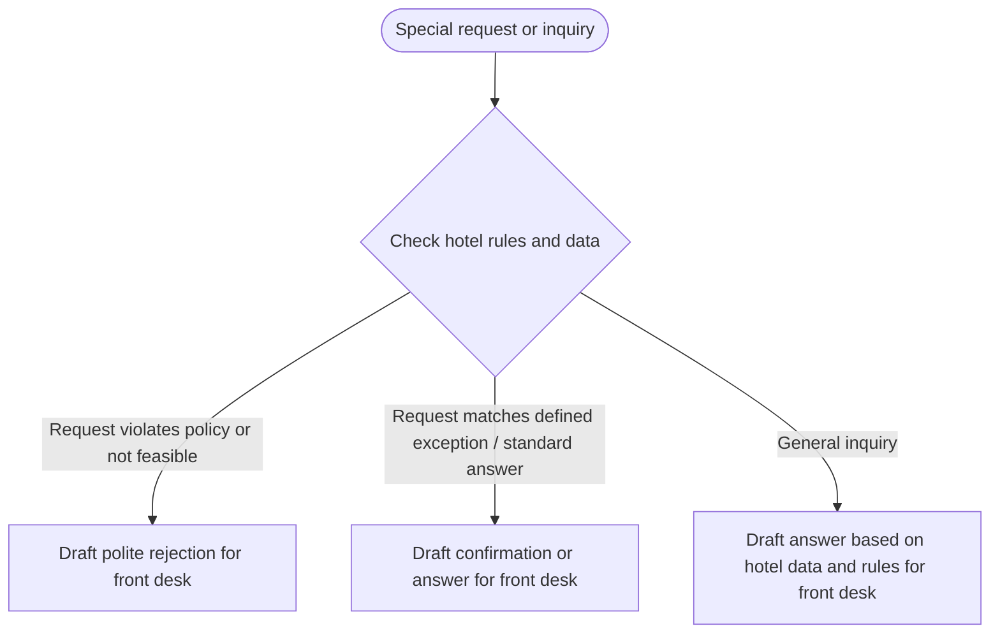

# MVP — Email Channel

Automated processing of all inbound hotel emails related to bookings and booking modifications. The agent reads emails, classifies intent, interacts with the PMS, and drafts responses for the front desk — replacing fully manual data entry and reducing errors.

## Problem

Wellness and resort hotels receive ~75% of booking modification requests by email. Today, every email requires manual reading, manual PMS entry, and manual reply — creating time cost, quality risk (missed guest wishes, wrong data), and no audit trail linking emails to PMS records.

## Scope

| Email type | Sender | Description |
|---|---|---|
| Booking confirmation | Booking Agency | Agency confirms a booking on behalf of a guest |
| Booking request | Guest (direct) | Guest requests availability and a reservation |
| Modification request | Guest or Agency | Cancellation, date change, room category change, or similar |
| Special request | Guest | Add-on wishes not changing the core booking (e.g. dietary needs) |
| General inquiry | Guest | Question about the hotel, services, or existing booking |

---

## Flow 1 — New Booking (Request or Agency Confirmation)

**Decision: firm vs. tentative**
- Agency confirmation email → firm booking
- Guest request without explicit commitment → tentative (optional in PMS, offer email drafted)

**PMS entry fields captured from email:**
guest name, contact details, arrival / departure dates, room category, number of guests, special wishes, booking source, agency name (if applicable)

---

## Flow 2 — Booking Modification

**Draft response when modification has cost or availability issues** must include:
- Applicable cancellation fee (e.g. "80% of booking value per contract")
- Availability check result for requested new dates / room category
- Alternative options if any
- Clear next step for the guest to confirm or decline

---

## Flow 3 — Special Requests and Inquiries

All outputs in Flow 3 are drafts — front desk reviews and sends.

---

## Daily Control Outputs

Two recurring reports, generated automatically each morning:

### 1 — Arrival report

Run twice: guests arriving in **2 weeks** and guests arriving in **3 days**.

For each report:
- List of all guests with that check-in date, pulled from PMS, including full booking details and notes
- Each row links to a detail view showing the original booking email(s) and full correspondence history
- Cross-check: PMS notes vs. email thread — flag any discrepancy (missing wish, conflicting data)

### 2 — Unanswered email report

Daily scan of the hotel inbox:
- Every inbound email in scope is matched to an outbound reply
- Emails with no reply drafted or sent are flagged for immediate front desk attention

---

## Key Benefits

| Benefit | Detail |
|---|---|
| Time saving | Eliminates manual PMS entry for email-channel bookings and modifications |
| Error reduction | No missed guest wishes, no mistyped dates or room categories |
| Audit trail | Every PMS record is linked to the originating email thread |
| Staff focus | Front desk reviews and approves; agent handles classification, data entry, and drafting |
