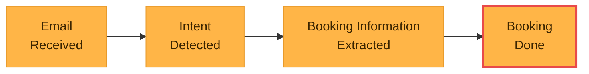

# Event Storming — Email Booking Channel

> Domain events captured for the email-channel ingestion pipeline. Linear, time-ordered flow.
>
> Captured during a moderated Event Storming session. The session intentionally stayed narrow — only the happy path of the email-channel pipeline. Broader scope is acknowledged below.

**Legend** — orange node: domain event (past tense). Red border: hotspot (open question, see below).

## Open hotspots

| Event | Question | Why it matters |
|---|---|---|
| `BookingDone` | Does "done" mean confirmed in our system, persisted to the ERP, or acknowledged back to the agency? | Each interpretation implies a different downstream consumer and likely a different event name. Probably splits into two events (e.g. `BookingPersisted` and `BookingConfirmedToAgency`). |

## Out of scope (acknowledged)

The session deliberately limited itself to four events on the email-channel happy path. Not yet covered:

- **Other channels** — Website, Channel Manager
- **Unhappy paths** — `ExtractionFailed`, `EmailUnparseable`, `DuplicateBookingDetected`, `RoomUnavailable`
- **Hotel-side downstream** — `RoomAssigned`, `GuestCheckedIn`, `InvoiceIssued`, `GuestCheckedOut`
- **Booking Assistant work** — review, correction, approval, escalation events
- **Lifecycle edges** — events before `EmailReceived` and long after `BookingDone` (loyalty, reviews, repeat bookings)

These should be captured in follow-up sessions and added either to this file (if scope expands) or as additional `event_storming_<scope>.md` files.
