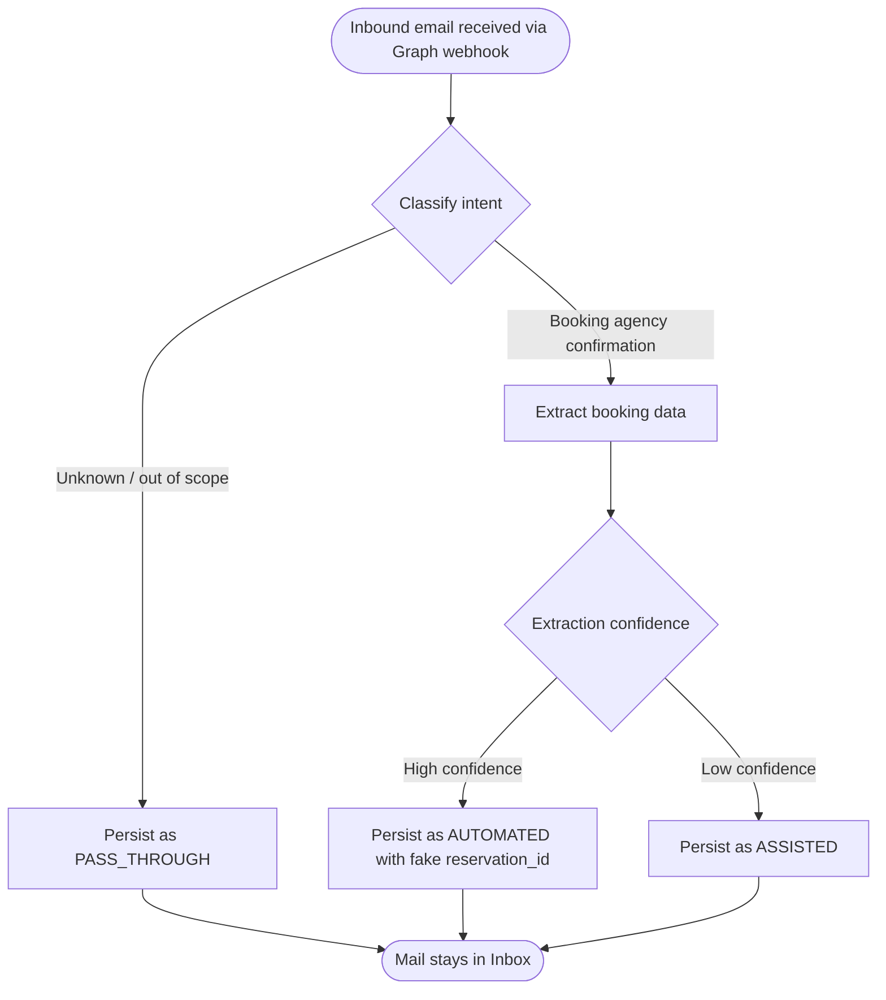
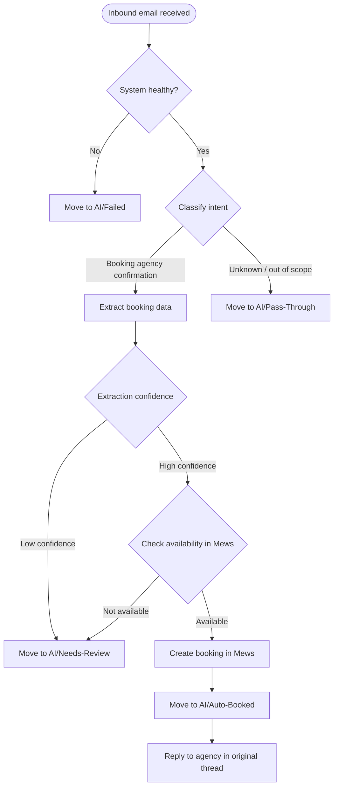

# MVP Flows — Email Booking Automation

> Two views: the **PoC flow** is what runs today (DB-Ledger only, no Mews, no front-desk emails). The **Target flow** is what the system grows into across the phases described in [`outlook_integration.md`](outlook_integration.md). We iterate together as we approach each phase.

## Participants

| Participant | Description |
|---|---|
| Booking Agency | External travel agent sending booking confirmation emails |
| Hotel Inbox | Hotel email inbox receiving inbound traffic (Outlook in the pilot) |
| Hospitality AI | The system — classifies, extracts, and routes |
| DB-Ledger | Postgres table where every processed email is recorded for SQL review |
| Mews | The hotel PMS where bookings are created (deferred — see `todo.md` item 5) |
| Front Desk | Hotel staff (Booking Assistant) — sees AI work in `AI/*` folders (Phase 2 onward) |

---

## PoC Flow — Phase 1 (DB-Ledger only)

The PoC validates the email-to-booking mapping. Tobi reviews the ledger by SQL; no automated PMS push, no folder routing, no outbound mail.

---

## Target Flow — All Phases combined

The target flow adds (cumulatively, by phase): folder routing in Phase 2, threaded replies to the booking agency in Phase 3, and the Mews integration once API access is available.

---

## Path Summary

| Path | Trigger | PoC behaviour | Target behaviour |
|---|---|---|---|
| **1 — Automated** | Booking confirmation, high confidence, available | Persist with fake reservation_id | Booking created in Mews + reply to agency + moved to `AI/Auto-Booked` |
| **2 — Assisted** | Booking confirmation, low confidence or unavailable | Persist as `assisted` | Moved to `AI/Needs-Review` |
| **3 — Pass-through** | Unknown or out-of-scope intent | Persist as `pass_through` | Moved to `AI/Pass-Through` |
| **3b — System failure** | Hospitality AI unavailable | Mail untouched (no DB write) | Moved to `AI/Failed` |

---

## Out of Scope — MVP

The following email intents are not processed by Hospitality AI in the MVP. All are routed via Path 3 (pass-through).

- Booking cancellations
- Booking modifications
- Special requests
- General inquiries
