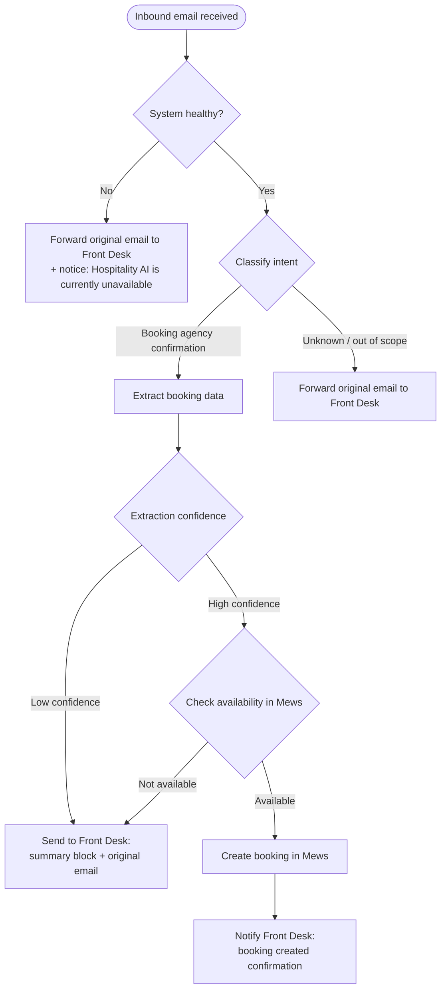

# MVP Flows — Email Booking Automation

## Participants

| Participant | Description |
|---|---|
| Booking Agency | External travel agent sending booking confirmation emails |
| Email Inbox | Hotel email inbox receiving inbound traffic |
| Hospitality AI | The system — classifies, extracts, and routes |
| Mews | The hotel PMS where bookings are created |
| Front Desk | Hotel staff (Booking Assistant) receiving email handoffs |

---

## Flow — Inbound Email Processing

---

## Path Summary

| Path | Trigger | System action | Front Desk receives |
|---|---|---|---|
| **1 — Automated** | Booking confirmation, high confidence, available | Create booking in Mews | Confirmation notification |
| **2 — Assisted** | Booking confirmation, low confidence or unavailable | No PMS action | Summary block + original email |
| **3 — Pass-through** | Unknown or out-of-scope intent | No PMS action | Original email only |
| **3b — System failure** | Mews or Hospitality AI unavailable | No PMS action | Original email + system unavailable notice |

---

## Out of Scope — MVP

The following email intents are not processed by Hospitality AI in the MVP.
All are routed via Path 3 (pass-through) to the Front Desk.

- Booking cancellations
- Booking modifications
- Special requests
- General inquiries
