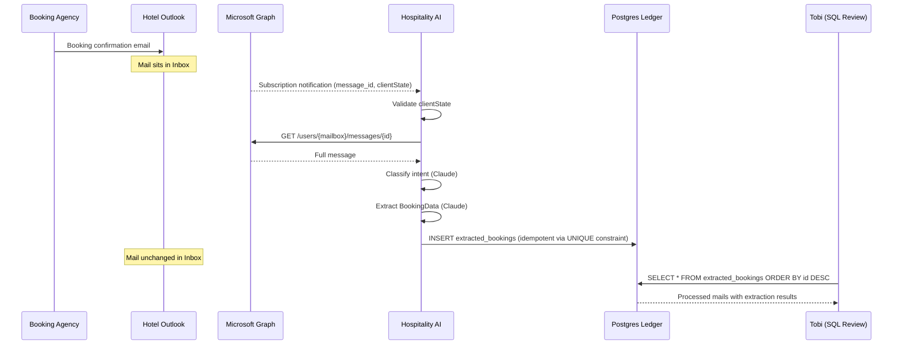
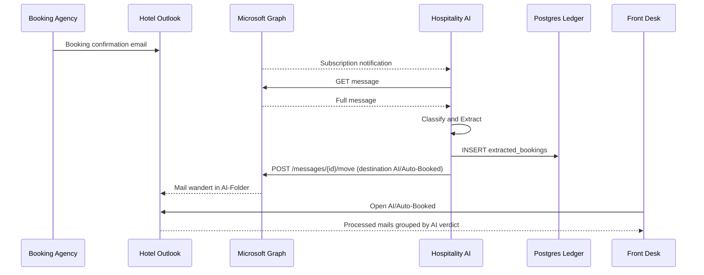
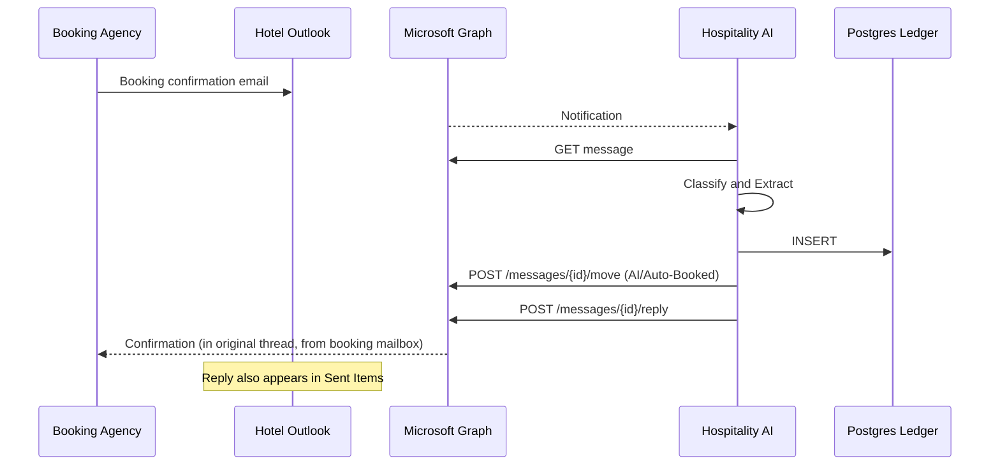

# Outlook Integration — Hotel-facing Behavior

How Hospitality AI behaves inside the hotel's Outlook inbox, evolved across three phases.

---

## DB-Ledger

A single Postgres table (`extracted_bookings`) where every processed email writes one append-only row containing the raw mail, the classification result, and the extracted booking fields. We use it as a validation harness for the PoC: instead of pushing bookings to Mews, we let Tobi review the rows by SQL and verify the email-to-booking mapping. Once the mapping is trusted, Mews is wired up and the ledger continues to live as the audit trail.

---

## Phase Overview

| Phase | What the system does | What the hotel sees in Outlook | Permission scope |
|---|---|---|---|
| **1 — PoC: DB-Ledger** | Read mail, classify, extract, write to DB | Nothing. Mail stays untouched in Inbox. | `Mail.Read` |
| **2 — + Folder Routing** | Phase 1 + move processed mail into `AI/*` folders | Mails appear in `AI/Auto-Booked` / `AI/Needs-Review` / `AI/Pass-Through` / `AI/Failed` | `Mail.ReadWrite` (additive consent) |
| **3 — + Outbound** | Phase 2 + threaded reply to the booking agency | Reply lands in the agency's original conversation, with the hotel mailbox as sender; copy in the booking mailbox's Sent Items | `Mail.Read` + `Mail.ReadWrite` + `Mail.Send` (additive consent) |

Front-desk notification emails are intentionally not part of any phase. Folder routing in Phase 2 is what gives the front desk visibility on what the AI did — a parallel notification email would be redundant noise.

---

## Phase 1 — DB-Ledger only (PoC)



---

## Phase 2 — + Folder Routing



**Delta to Phase 1**

- Hotel admin grants additive consent for `Mail.ReadWrite`.
- Onboarding script creates the four folders.
- Use case adds `MailboxRouter.move_to_folder` after `ledger.persist`.
- Idempotency model unchanged — DB unique constraint still suffices.

---

## Phase 3 — + Outbound (threaded reply to agency)



**Delta to Phase 2**

- Hotel admin grants additive consent for `Mail.Send`.
- Reply preserves the thread and original `From:` — the agency sees it as the hotel responding, not a separate AI identity.
- A copy lands in the booking mailbox's Sent Items, so the front desk can audit replies in the same place they read inbound mail.
- No separate front-desk notification — folder routing in Phase 2 already provides front-desk visibility.
- Open questions on reply format (see `open_questions.md` items 1–3) must be resolved first.

---

## Permission migration

```
Phase 1:   Mail.Read
              ↓  additive admin consent
Phase 2:   Mail.Read + Mail.ReadWrite
              ↓  additive admin consent
Phase 3:   Mail.Read + Mail.ReadWrite + Mail.Send
```

Microsoft Entra accepts additive consent without re-registering the app. Each phase transition produces a fresh consent link with the new scopes; the hotel admin clicks through and existing scopes are preserved.
