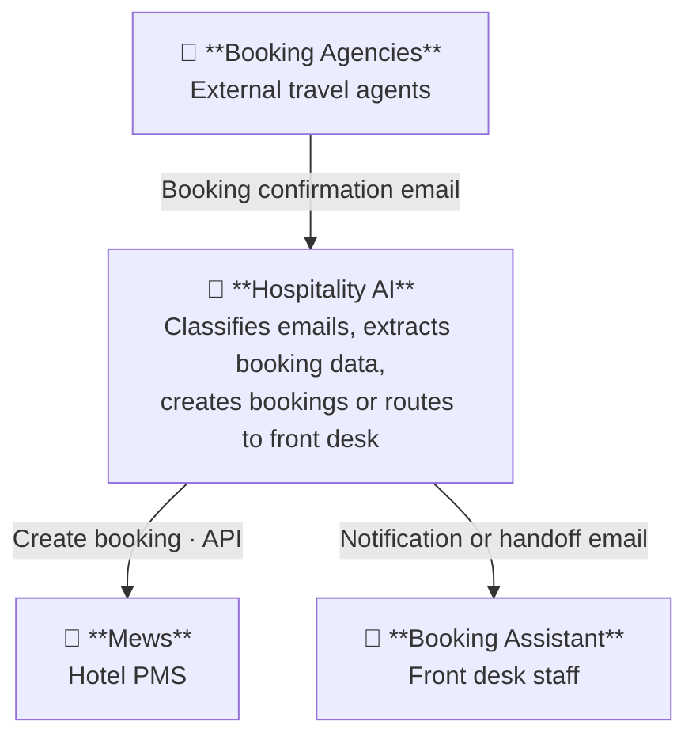
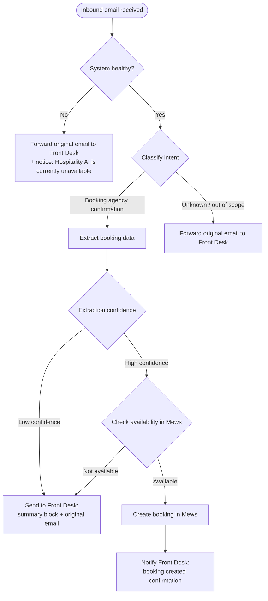

# MVP Overview — Email Booking Automation

> Single-page reference for the MVP scope. Source files live alongside this document.

---

## Table of Contents

1. [System Context](#1-system-context)
2. [Flows](#2-flows)
3. [Todo — Before MVP](#3-todo--before-mvp)
4. [Open Questions](#4-open-questions)

---

## 1. System Context

> MVP scope: email channel from booking agencies only. Hotel Website, Channel Manager, Booking Portals, Hotel Guest, and Hotel Manager are out of scope for the MVP.

---

## 2. Flows

### Participants

| Participant | Description |
|---|---|
| Booking Agency | External travel agent sending booking confirmation emails |
| Email Inbox | Hotel email inbox receiving inbound traffic |
| Hospitality AI | The system — classifies, extracts, and routes |
| Mews | The hotel PMS where bookings are created |
| Front Desk | Hotel staff (Booking Assistant) receiving email handoffs |

### Inbound Email Processing

### Path Summary

| Path | Trigger | System action | Front Desk receives |
|---|---|---|---|
| **1 — Automated** | Booking confirmation, high confidence, available | Create booking in Mews | Confirmation notification |
| **2 — Assisted** | Booking confirmation, low confidence or unavailable | No PMS action | Summary block + original email |
| **3 — Pass-through** | Unknown or out-of-scope intent | No PMS action | Original email only |
| **3b — System failure** | Mews or Hospitality AI unavailable | No PMS action | Original email + system unavailable notice |

### Out of Scope — MVP

The following email intents are routed via Path 3 (pass-through) to the Front Desk:

- Booking cancellations
- Booking modifications
- Special requests
- General inquiries

---

## 3. Todo — Before MVP

### Tech

| # | Task | Owner | Status | Notes |
|---|---|---|---|---|
| 1 | How to host the application | Tobias | Done | Railway — app + PostgreSQL plugin |
| 2 | Simple solution design | Tobias | Done | Hexagonal — inbound email port, domain core, Mews + email outbound ports |
| 3 | Choose technologies | Tobias | Done | Python, Postmark inbound webhook, Mews Connector API |
| 4 | Define basic ADR framework | Tobias | Done | ADRs in docs/adr/ — see ADR-0002, ADR-0003 |
| 5 | Set up Mews access for development | Tobias | Open | Use Mews demo environment — no sign-up needed, public shared tokens available |
| 6 | Set up Postmark inbound webhook | Tobias | Open | Create Postmark account, configure inbound forwarding rule from hotel inbox |
| 7 | Provision Railway project | Tobias | Open | Create project, add PostgreSQL plugin, set env vars |

---

## 4. Open Questions

| # | Question | Raised | Status |
|---|---|---|---|
| 1 | Should a confirmation email also be sent to the booking agency after a successful auto-booking, in addition to the internal front desk notification? | 2026-04-15 | Open |
| 2 | Path 2 delivery format: one structured email (summary block + forwarded original) is the current assumption — confirm whether the summary should follow a specific template or be free-form AI-generated. | 2026-04-15 | Open |
