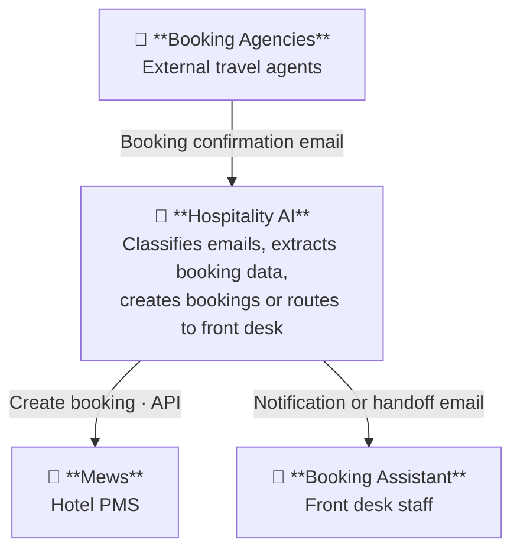

# MVP Overview — Email Booking Automation

> Single-page reference for the MVP scope. Source files live alongside this document.

---

## Table of Contents

1. [System Context](#1-system-context)
2. [Flows](#2-flows)
3. [Todo — Before MVP](#3-todo--before-mvp)
4. [Open Questions](#4-open-questions)

Related:
- [Outlook Integration — Hotel-facing Behavior](outlook_integration.md) — phased rollout (DB-Ledger → Folder Routing → Outbound)

---

## 1. System Context

> MVP scope: email channel from booking agencies only. Hotel Website, Channel Manager, Booking Portals, Hotel Guest, and Hotel Manager are out of scope for the MVP.

---

## 2. Flows

See [`flows.md`](flows.md) for the PoC flow, the target flow, the path summary, and the out-of-scope list. Diagram + tables are kept there as the single source of truth — duplicating them here led to drift.

---

## 3. Todo — Before MVP

### Tech

See [`todo.md`](todo.md) for the full list. Headline status:

| # | Task | Status |
|---|---|---|
| 1–4 | Hosting, solution design, tech choice, ADR framework | Done |
| 5 | Mews access | Open — awaiting demo creds |
| 6 | Railway project | Open |
| 7 | Anthropic API key | Done |
| 8 | Repo structure | Done |
| 9 | MewsClient wrapper | Done |

---

## 4. Open Questions

See [`open_questions.md`](open_questions.md) for the full list, including the phase each question applies to.
