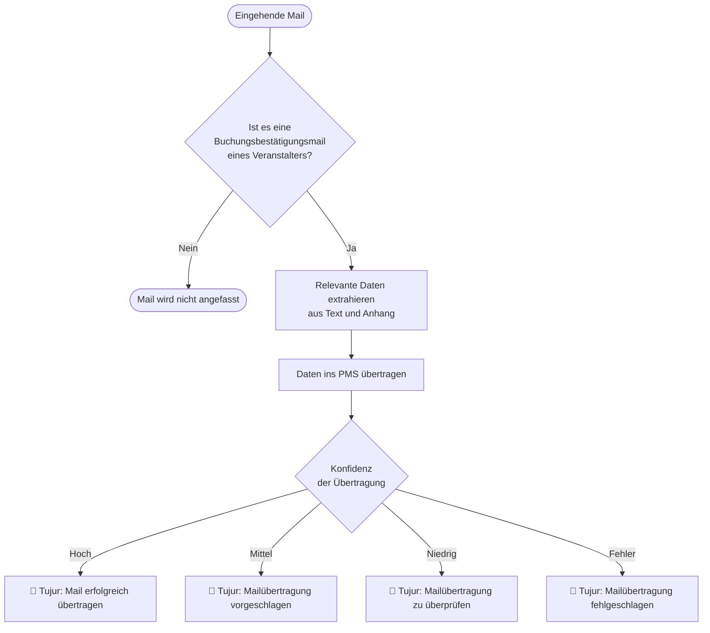

# MVP — Email Channel

Automatische Erkennung und PMS-Eintragung von Buchungsbestätigungen der Veranstalter aus dem Hotel-Postfach — ohne manuellen Eingriff durch das Rezeptionsteam.

## Problem

Wellness- und Resorthotels erhalten einen Großteil ihrer Buchungen als E-Mail-Bestätigungen von Reiseveranstaltern. Heute wird jede Mail manuell gelesen, manuell ins PMS übertragen und die Eingangsbestätigung manuell zurückgeschickt — fehleranfällig, zeitintensiv, und ohne nachvollziehbaren Audit-Trail.

---

## MVP Scope

**Im Scope:** Buchungsbestätigungsmails von Reiseveranstaltern (Agencies).

**Nicht im Scope (Phase 2):** Gästeanfragen, Buchungsmodifikationen, Stornierungen, Sonderanfragen, allgemeine Anfragen, tägliche Reports.

---

## Onboarding

Beim Start zieht der Algorithmus zwei Datenquellen:

1. **Alle bestehenden Buchungen aus dem PMS** des Kunden
2. **Alle Buchungsbestätigungsmails der Veranstalter** aus dem E-Mail-Postfach des Kunden

Aus dem Abgleich dieser beiden Quellen lernt der Algorithmus, wie die Buchungsbestätigungen korrekt ins PMS einzutragen sind (Feldmapping, Formatierung, Veranstalter-spezifische Besonderheiten).

Dieser Lernschritt wiederholt sich **wöchentlich**, um neue Formate und Veranstalter automatisch aufzunehmen.

---

## Flow — Buchungsbestätigung verarbeiten

### Schritt 1 — E-Mail Eingang

Alle Mails des Kunden werden an das TUJUR-System weitergeleitet:

- **Standard:** Der Kunde forwardet alle eingehenden Mails an eine TUJUR-Adresse
- **Optional:** TUJUR verbindet sich direkt mit dem Mailpostfach des Kunden und liest regelmäßig neue Mails aus (Real-Time-Zugriff)

### Schritt 2 — Klassifikation

Der Algorithmus prüft jede eingehende Mail:
- Handelt es sich um eine **Buchungsbestätigungsmail eines Reiseveranstalters**?
- Wenn **nein** → Mail wird ignoriert, keine weitere Verarbeitung
- Wenn **ja** → weiter zu Schritt 3

### Schritt 3 — PMS-Übertragung

Der Algorithmus extrahiert die buchungsrelevanten Daten aus der Mail (Text und Anhänge) und trägt sie ins PMS ein.

### Schritt 4 — Konfidenz-Rückmeldung

Je nach Sicherheit bei der Übertragung sendet der Algorithmus eine Statusmail vom TUJUR-Postfach an den Kunden:

| Konfidenz | Status | Bedeutung |
|---|---|---|
| Hoch | ✅ Tujur: Mail erfolgreich übertragen | Daten vollständig und sicher eingetragen |
| Mittel | 🔶 Tujur: Mailübertragung vorgeschlagen | Eintrag vorgeschlagen, Kurzprüfung empfohlen |
| Niedrig | ⚠️ Tujur: Mailübertragung zu überprüfen | Unsichere Extraktion, manuelle Prüfung nötig |
| Fehler | ❌ Tujur: Mailübertragung fehlgeschlagen | Keine Übertragung, manuelle Bearbeitung erforderlich |

**Optional:** Zusätzlich zur Statusmail wird die ursprüngliche Mail in einen Unterordner des Kundenpostfachs verschoben, der dem Konfidenz-Status entspricht (gleiche vier Kategorien wie oben).

---

## Phase 2 — Spätere Erweiterungen

Folgende Features sind bewusst aus dem MVP ausgeschlossen und für spätere Phasen vorgesehen:

- Gästeanfragen und direkte Buchungsanfragen
- Buchungsmodifikationen (Umbuchung, Stornierung, Datumsänderung)
- Sonderanfragen und allgemeine Gästekommunikation
- Täglicher Anreisereport und unantwortete-Mails-Report
- Automatische Antwortmails an Gäste und Veranstalter
