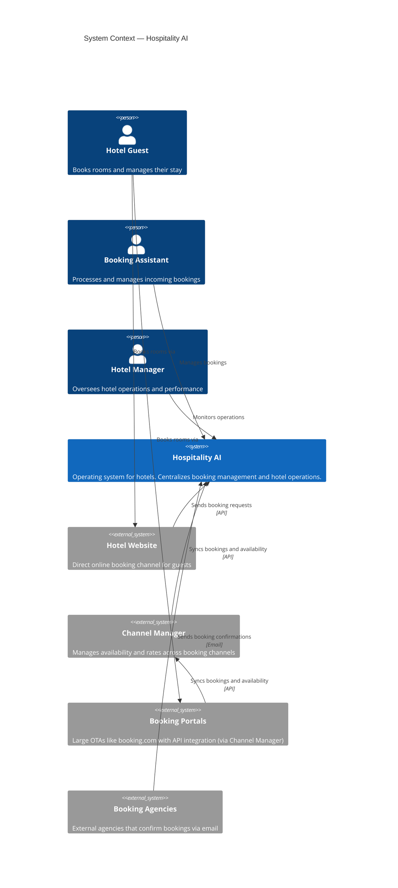
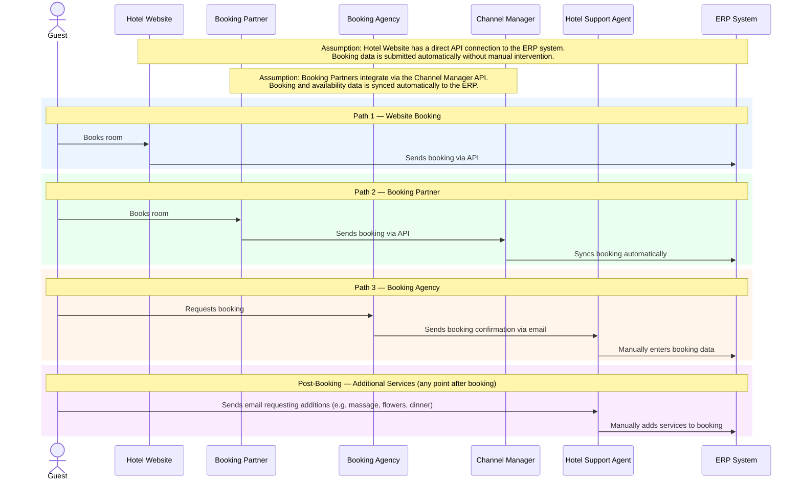
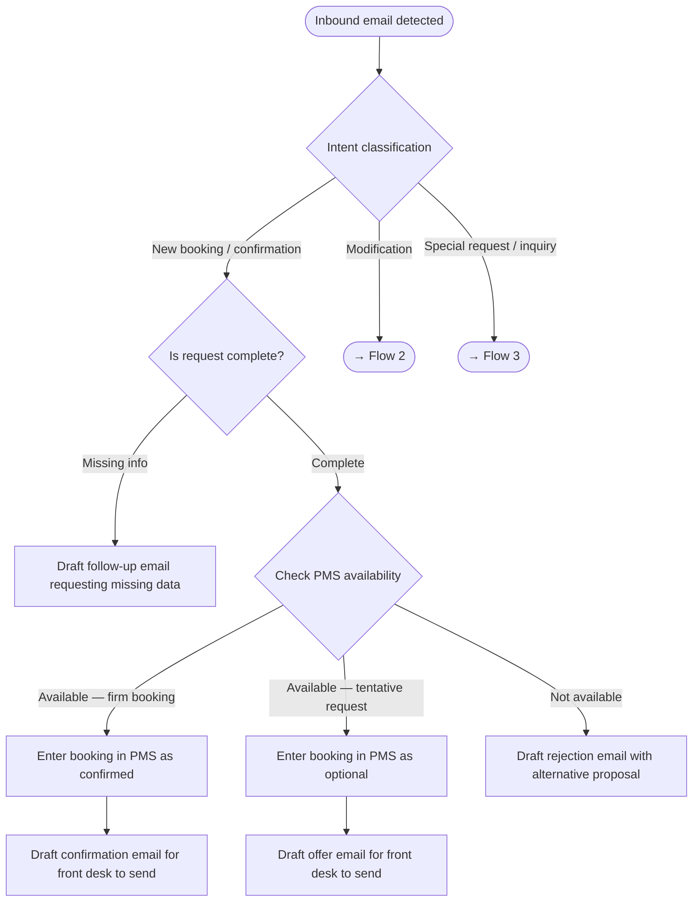
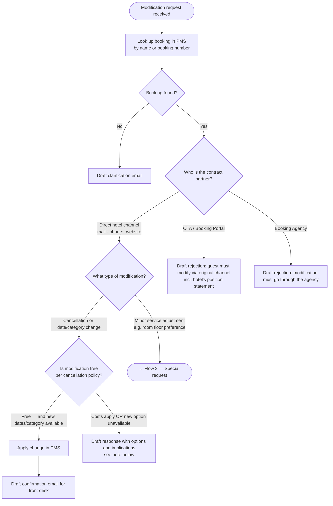
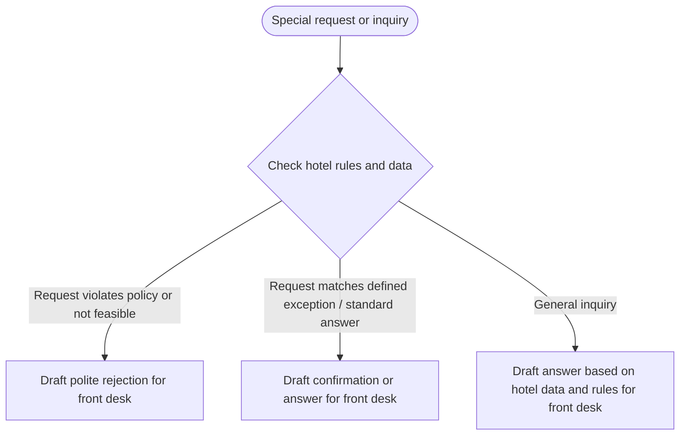
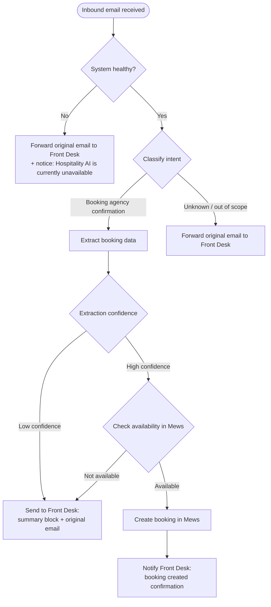

# Hospitality AI — Full Overview

> Single-page reference combining all project documentation. Source files live in their respective locations — this document is generated for review purposes.

---

## Table of Contents

1. [Project](#1-project)
2. [Glossary](#2-glossary)
3. [Architecture](#3-architecture)
4. [Domain — As-Is](#4-domain--as-is)
5. [Domain — MVP Email Channel (Prior Scope Doc)](#5-domain--mvp-email-channel-prior-scope-doc)
6. [Solution — MVP Flows](#6-solution--mvp-flows)
7. [Open Questions](#7-open-questions)

---

## 1. Project

Hospitality AI is an operating system for hotels. It centralizes hotel operations, starting with the booking process — one platform for all booking channels, guest interactions, and hotel operations.

**Current focus:** Booking process — integrating all incoming booking channels into one system.

### Booking Channels

| Channel | Integration method |
|---|---|
| Hotel Website | Direct API |
| Booking Agencies (e.g. travel agents) | Email (parsed, AI-powered) |
| Booking Portals (e.g. booking.com) | API via Channel Manager |

---

## 2. Glossary

| Term | Definition |
|---|---|
| **Booking Assistant** | Hotel staff who process and manage incoming bookings |
| **Booking Agency** | External travel agent that sends booking confirmations via email |
| **Booking Partner / Portal** | Large OTAs (e.g. booking.com) that integrate via the Channel Manager |
| **Channel Manager** | Third-party system that manages availability and rates across booking portals |
| **ERP System** | The hotel's core back-office system where bookings are recorded |
| **PMS (Property Management System)** | The hotel's property management software — the operational layer of the ERP where reservations are created and managed day-to-day |
| **Mews** | The PMS used by the first customer |
| **Hotel Manager** | Oversees hotel operations and performance |
| **Hotel Guest** | Books rooms and manages their stay |

---

## 3. Architecture

### C1 — System Context

> Shows Hospitality AI in relation to its users and external systems.

---

## 4. Domain — As-Is

### Current Booking Process

> How bookings reach the hotel today, before Hospitality AI is in the picture.

---

## 5. Domain — MVP Email Channel (Prior Scope Doc)

> Source: `docs/domain/mvp_email_channel.md`

Automated processing of all inbound hotel emails related to bookings and booking modifications. The agent reads emails, classifies intent, interacts with the PMS, and drafts responses for the front desk — replacing fully manual data entry and reducing errors.

### Problem

Wellness and resort hotels receive ~75% of booking modification requests by email. Today, every email requires manual reading, manual PMS entry, and manual reply — creating time cost, quality risk (missed guest wishes, wrong data), and no audit trail linking emails to PMS records.

### Scope

| Email type | Sender | Description |
|---|---|---|
| Booking confirmation | Booking Agency | Agency confirms a booking on behalf of a guest |
| Booking request | Guest (direct) | Guest requests availability and a reservation |
| Modification request | Guest or Agency | Cancellation, date change, room category change, or similar |
| Special request | Guest | Add-on wishes not changing the core booking (e.g. dietary needs) |
| General inquiry | Guest | Question about the hotel, services, or existing booking |

### Flow 1 — New Booking (Request or Agency Confirmation)

**Decision: firm vs. tentative**
- Agency confirmation email → firm booking
- Guest request without explicit commitment → tentative (optional in PMS, offer email drafted)

**PMS entry fields captured from email:**
guest name, contact details, arrival / departure dates, room category, number of guests, special wishes, booking source, agency name (if applicable)

### Flow 2 — Booking Modification

### Flow 3 — Special Requests and Inquiries

All outputs in Flow 3 are drafts — front desk reviews and sends.

---

## 6. Solution — MVP Flows

> Source: `docs/domain/solution/mvp/flows.md`

### Participants

| Participant | Description |
|---|---|
| Booking Agency | External travel agent sending booking confirmation emails |
| Email Inbox | Hotel email inbox receiving inbound traffic |
| Hospitality AI | The system — classifies, extracts, and routes |
| Mews | The hotel PMS where bookings are created |
| Front Desk | Hotel staff (Booking Assistant) receiving email handoffs |

### Flow — Inbound Email Processing

### Path Summary

| Path | Trigger | System action | Front Desk receives |
|---|---|---|---|
| **1 — Automated** | Booking confirmation, high confidence, available | Create booking in Mews | Confirmation notification |
| **2 — Assisted** | Booking confirmation, low confidence or unavailable | No PMS action | Summary block + original email |
| **3 — Pass-through** | Unknown or out-of-scope intent | No PMS action | Original email only |
| **3b — System failure** | Mews or Hospitality AI unavailable | No PMS action | Original email + system unavailable notice |

### Out of Scope — MVP

The following email intents are not processed by Hospitality AI in the MVP.
All are routed via Path 3 (pass-through) to the Front Desk.

- Booking cancellations
- Booking modifications
- Special requests
- General inquiries

---

## 7. Open Questions

> Source: `docs/domain/solution/mvp/open_questions.md`

| # | Question | Raised | Status |
|---|---|---|---|
| 1 | Should a confirmation email also be sent to the booking agency after a successful auto-booking, in addition to the internal front desk notification? | 2026-04-15 | Open |
| 2 | Path 2 delivery format: one structured email (summary block + forwarded original) is the current assumption — confirm whether the summary should follow a specific template or be free-form AI-generated. | 2026-04-15 | Open |
